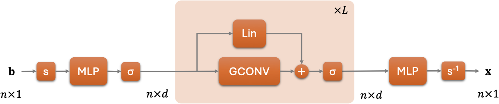

# GNP: Graph Neural Preconditioners

GNP [(Chen 2025)](#Chen2025) is a general-purpose (a.k.a. algebraic) preconditioner in the form of a graph neural network. As a nonlinear operator, it approximates $\mathbf{A}^{-1}$ and can be used together with a flexible Krylov method to solve a linear system $\mathbf{A}\mathbf{x}=\mathbf{b}$.



Compared with other mainstream algebraic preconditioners, GNP performs comparatively much better for ill-conditioned problems, mitigating the restrictive modeling of the sparsity pattern (as in ILU and approximate inverse), the insufficient quality of polynomial approximation (as in using Krylov methods as the preconditioner), and the challenge of smoothing over a non-geometric mesh (as in AMG). Additionally, the construction time of GNP is more predictable than that of ILU and AMG; and the execution time of GNP is much shorter than GMRES as the preconditioner.

The current implementation of GNP is used with FGMRES for non-SPD systems. The system is static and has only one right-hand side. Neural network training and inference are conducted on at most one GPU, which limits the size of $\mathbf{A}$ it can handle. Extensions are on the way.

## Installation and Usage

1. Clone this repository:

```bash
git clone https://github.com/jiechenjiechen/GNP.git
cd GNP
```

2. Install Conda and create a Conda environment. Follow instructions on the [Conda user guide](https://docs.conda.io/projects/conda/en/latest/user-guide/install/index.html). For example, to install Miniconda on an x86 Linux machine:

```bash
wget https://repo.anaconda.com/miniconda/Miniconda3-latest-Linux-x86_64.sh
bash Miniconda3-latest-Linux-x86_64.sh
```

It is highly recommended to create a new python environment. Example with a new environment called `gnp`:

```bash
conda create -n gnp python=3.12 -y
conda activate gnp
```

3. Install PyTorch. Follow instructions on the [PyTorch homepage](https://pytorch.org). For example, to install on a Linux machine with CUDA 12.4:

```bash
conda install pytorch torchvision torchaudio pytorch-cuda=12.4 -c pytorch -c nvidia
```

Note: At the moment this README is written, there seem to be some incompatibility issues inside pytorch for Mac (when I import torch it complains numpy version is too high). A workaround is to downgrade numpy:

```bash
pip install "numpy<2.0"
```

4. Install this GNP package (such that you can use it through `import GNP`):

```bash
python -m pip install .
```

5. Install additional packages to run the examples:

```bash
pip install -r requirements.txt
```

6. Download the [ssget](https://sparse.tamu.edu/interfaces) package, which provides a default location to store the SuiteSparse matrices. The downloaded package is named `ssget.tar`. Uncompress it and place it inside some folder `$SUITESPARSE`, such as `~/data/SuiteSparse`. Set the bash variable reused later.

```bash
export SUITESPARSE=$HOME/data/SuiteSparse
```

7. Run an example. The example `examples/simple.py` shows how to use GNP to solve a linear system from SuiteSparse. The option `--num_workers` specifies the number of dataloader workers used in GNP training. On a CPU machine, use the default 0 (i.e., do not invoke the command line option).

```bash
cd examples
python simple.py --location $SUITESPARSE/ssget/mat \
                 --problem VanVelzen/std1_Jac3 \
                 --num_workers 4
```

8. For a more comprehensive usage of the package, try `examples/all_in_one.py`. This code demonstrates the usage of several implemented preconditioners and various algorithmic choices, such as different ways to generate training data for GNP.

```bash
python all_in_one.py --location $SUITESPARSE/ssget/mat \
                     --problem VanVelzen/std1_Jac3 \
                     --preconditioners gnp gmres ilu amg jacobi \
                     --save_model \
                     --epochs 2000 \
                     --num_workers 4
```

## Citation

- <a name="Chen2025"></a>Jie Chen. [Graph Neural Preconditioners for Iterative Solutions of Sparse Linear Systems](https://arxiv.org/abs/2406.00809). In Proceedings of the Thirteenth International Conference on Learning Representations, 2025.
